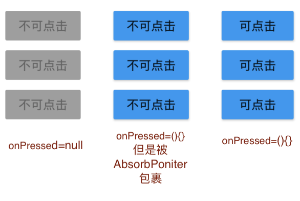
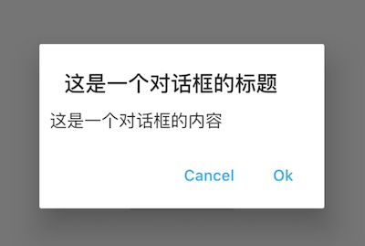

# Flutter 150多个widget用法示例全集

---
## 字母A开头系列


### AbsorbPointer

如果要让一个按钮不可点击一般可以让onPressed = null， 但是这个会改变按钮的风格
```dart
RaisedButton(
        child: Text('Click me'),
        onPressed: null,)
```
有时候会遇到的需求是，让某一片区域不可点击。<br>
当absorbing为true时，用户输入事件被吸收，不会再把事件传递给RaisedButton，一般用来禁止某一片区域的点击事件

AbsorbPointer的参数
* 【absorbing】是否吸收用户输入
```dart
AbsorbPointer(
  absorbing: true,
  child: Column(
    children: <Widget>[
      RaisedButton(
        child: Text('Click me'),
        onPressed: () {
          showToast('clicked!');
        },
      ),
      RaisedButton(
        child: Text('Click me'),
        onPressed: () {
          showToast('clicked!');
        },
      ),
      RaisedButton(
        child: Text('Click me'),
        onPressed: () {
          showToast('clicked!');
        },
      ),
    ],
  ),
)
```


---

### AlertDialog
弹出提示框<br>
AlertDialog的参数
* 【title】标题
* 【titlePadding】标题padding
* 【titleTextStyle】标题文字风格
* 【content】提示框内容
* 【contentPadding】内容padding
* 【contentTextStyle】内容文字风格
* 【action】提示框按钮
* 【actionsPadding】提示框按钮padding
* 【actionsOverflowDirection】如果action的child数量太多，可选择child排列顺序，支持VerticalDirection.down 和 VerticalDirection.up
* 【actionsOverflowButtonSpacing】Overflow 时 child 的上下间距
* 【buttonPadding】action button的padding
* 【backgroundColor】提示框背景色
* 【elevation】提示框Z轴高度
* 【semanticLabel】语义标签，暂时不知道用处
* 【insetPadding】提示框距屏幕四周的padding
* 【clipBehavior】: 有关裁切的属性，暂不明应用场景
* 【shape】提示框形状
* 【scrollable】当内容长度大于提示框高度时，内容是否可滚动
```dart
showDialog(
  barrierDismissible: false, //barrierDismissible = true 时点击AlertDialog外部，会使AlertDialog消失，false 则不会
  context: context,
  builder: (context) => AlertDialog(
    title: Text('这是一个对话框的标题'),
    content: Text(
      '这是一个对话框的内容',
    ),
    contentPadding: EdgeInsets.all(10),
    actions: <Widget>[
      FlatButton(
        child: Text('Cancel'),
        onPressed: () {
          Navigator.pop(context);
        },
      ),
      FlatButton(
        child: Text('Ok'),
        onPressed: () {
          Navigator.pop(context);
        },
      )
    ],
  ),
);
```


